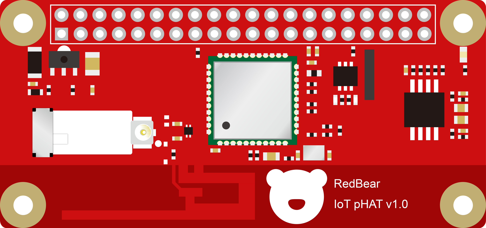
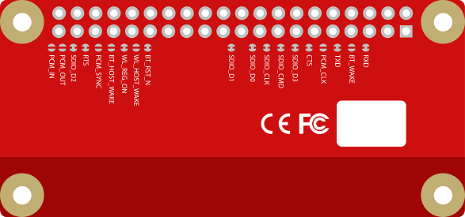
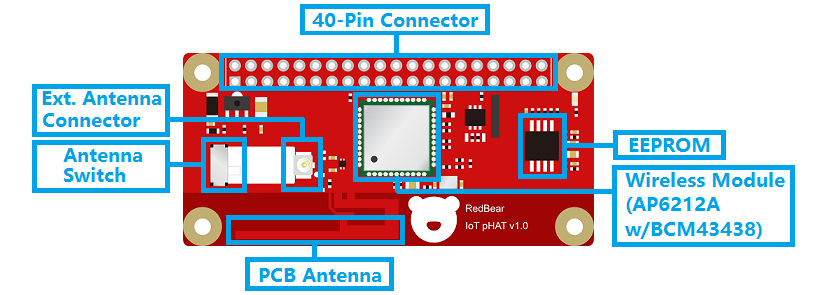
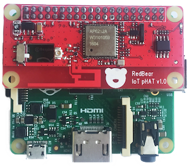
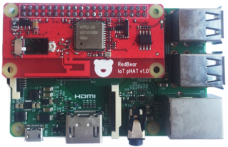
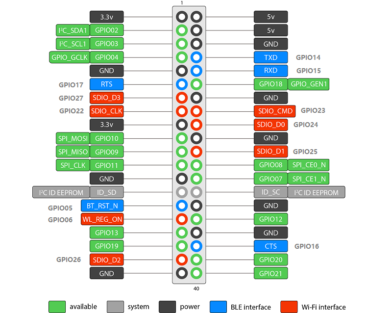
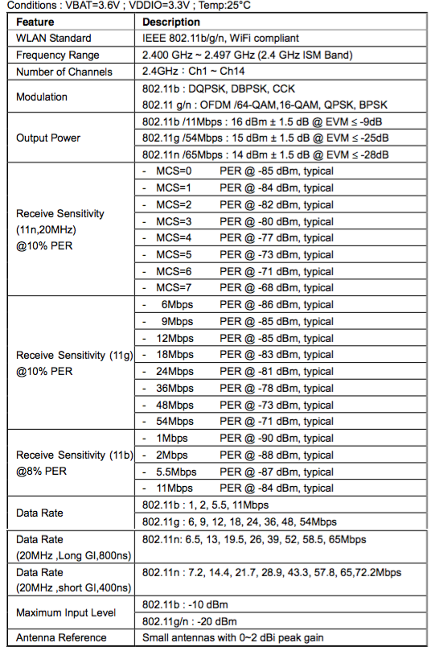
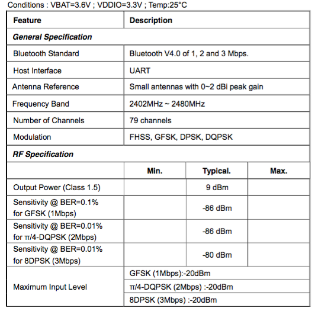

# IoT pHAT

RedBear IoT pHAT, designed for the Raspberry Pi Zero (other RPi boards with 40-pin header will also work).

The RPi Zero is a nice board, it is small in size which is very good for developing IoT projects and prototypes. However, it lacks of wireless features such as WiFi and Bluetooth.

With the IoT pHAT, now, your RPi Zero will get more powerful than before. It adds WiFi and Bluetooth wireless technologies to the RPi Zero.

	Note for beta testers with older version of the IoT pHAT:

		This is for the hardware version 1.0 only, the EEPROM contains the information for automatically starting the WiFi, Bluetooth and other settings.
	
* Front View

	

* Back View

	


## Block Diagram
	



## Features

* AMPAK AP6212A Wireless Module (Broadcom BCM43438 A1 chip inside)
	- WiFi (802.11bgn / 2.4GHz)
	- Bluetooth (4.1) and BLE support
* Single antenna for concurrent WiFi and Bluetooth operations
	- Onboard PCB antenna
	- External antenna connector
 	- Antenna switch for extenal antenna
* 32 Kbit (4 KByte) EEPROM for DTOverlay configuration
* 40-pin connector
	- WiFi: SDIO v2.0 - up to 20 MHz clock rate
	- Bluetooth: UART (up to 4 Mbps)
* FCC/CE certified


## How to play

### Prerequisites

* WiFi Router or Access Point (2.4 GHz enabled) and connected to the Internet

* Raspberry Pi Zero or other models with 40 pin connector header
	- HDMI Cable
	- USB Keyboard
	- Power adapter (5V) with micro USB connector

* SD Card with [NOOBS or Raspbian](https://www.raspberrypi.org/downloads/) installed (tested on NOOBS 1.9.2)

* Additional Items for RPi Zero
	- Mini HDMI to normal HDMI converter
	- Micro to Type-A USB converter

* Optional
	- Bluetooth Keyboard
	- Bluetooth Mouse
	- Bluetooth Gamepad
		
### Setting up the boards


* Stack the IoT pHAT on top of the RPi Zero
* Connect the board to your TV or monitor via the HDMI cable
* Connect your RPi with a wired keyboard (For associating WiFi to access point and pair Bluetooth accessories)
* Power on with an micro USB cable with power adpater

The IoT pHAT will also work on other 40-pin RPi boards such as RPi Model A+ and RPi 2.





### Updating the EEPROM

* Check EEPROM firmware version

	- `$ cat /proc/device-tree/hat/product` 
	- if it shows `IoT pHAT`, then the update is required.
	- if it shows `IoT pHAT w/eep_v0.3`, then you do not need to update it.
	
* The WiFi is not stable with SDIO 40 MHz clock and we need to reduce to 20 MHz.

* Follow [this guide](eeprom/experimental) to update the EEPROM with version 0.3.

### WiFi

* After booting up, the Linux kernel will read the configuration from the onboard EEPROM, it will turn on the WiFi driver

* Now you can use WiFi to connect to your wireless router or access point directly.

* You will see the WiFi driver (wlan0) is up by typing the follow command using the command line,

	`$ ifconfig`

* if you are in the command line, you can add your WiFi credentials to this file, it will connect to the AP automatically.

	Edit the file,
	
	`$ sudo nano /etc/wpa_supplicant/wpa_supplicant.conf`
	
	Add,
	
	```
	network={
		ssid="Your AP"
		psk="Your PIN"
		key_mgmt=WPA-PSK
	}
	```

	Reboot,
	
	`$ sudo reboot`
	
* Trouble-shooting

	- if you do not see the wlan0 device using `ifconfig`, then use the following command, you should see there is a folder named `iothat`. It should be something wrong if you do not see it.
	
		```
		$ ls /proc/device-tree/soc/
		```
		
	- check if your board comes without the 40-pin connector soldered, make sure your soldering is correct and check the I2C ID EEPROM pins (see the pinout diagram for details). 
	
### Bluetooth

* The default UART clock (3 MHz) will not work for the Bluetooth, so we need to set the clock to 48 MHz ([issue 4](https://github.com/redbear/IoT_pHAT/issues/4), it will be fixed in the next release of Raspbian, [raspberrypi/firmware/issues/643](https://github.com/raspberrypi/firmware/issues/643)).

	- use `$ sudo nano /boot/config.txt` to edit the file
	- add `init_uart_clock=48000000` to the end
	- reboot by `$ sudo reboot`

* Again, upon booting up the board, the Kernel will read from the EEPROM for all settings for the Bluetooth including the UART which maps UART0 to GPIO 14 and 15.

* You will see the Bluetooth is ready to use by using the Bluetooth manager (the Bluetooth icon) near to the clock (upper-right corner) or using the command line,

	`$ hciconfig`

	or
	
	`$ systemctl status hciuart.service`
	
### Pairing Bluetooth Keyboard/Mouse/Gamepad

You can use the command line tool `bluetoothctl` or the Bluetooth manager to pair your Bluetooth accessories.

#### Keyboard

* Example for using the command line, AA:BB:CC:DD:EE:FF here should be your Bluetooth keyboard MAC address. Make your keyboard into pairing mode first,

	```
	$ sudo bluetoothctl
	[bluetooth]# agent KeyboardDisplay
	[bluetooth]# default-agent
	[bluetooth]# scan on
	[bluetooth]# pair AA:BB:CC:DD:EE:FF
	Enter the PIN code from the Bluetooth keyboard
	[bluetooth]# connect AA:BB:CC:DD:EE:FF
	[bluetooth]# trust AA:BB:CC:DD:EE:FF
	[bluetooth]# quit
	```
	
Note: It seems that the BlueZ does not support BLE keyboard and mouse.

#### Gamepad (8Bitdo Zero)

Prerequisites:

* Charging the gamepad for a while.
* Make sure it is turned off (holding the `START` button for 2 seconds to power ON/OFF).

To pairing:

* Set the gamepad to the correct mode by pressing and holding the `START` button until you see a white LED light on. Release the button, it will enter to the power off state.

* Turn on the gamepad by holding the `START` button for 2 seconds.

* Holding the `SELECT` button for 3 seconds to clear any previous pairing, you will see the white LED flash once, release it.

* Use the follow steps:

	```
	$ sudo bluetoothctl
	[bluetooth]# scan on
	[bluetooth]# pair AA:BB:CC:DD:EE:FF	
	[bluetooth]# connect AA:BB:CC:DD:EE:FF
	[bluetooth]# trust AA:BB:CC:DD:EE:FF
	[bluetooth]# quit
	```
	
* To test the gamepad

	```
	$ sudo apt-get install joystick
	$ jstest /dev/input/js0
	```

* If you paired two gamepad, the 2nd one will be the `/dev/input/js1` device.


## Pinout

The following diagram shows the pins of the RPi 40-pin connector occupied by the IoT pHAT board.

Note that, the TXD on the RPi (as shown in the diagram) will connect to the RXD of the IoT pHAT, the same case applied to the RXD, CTS and RTS pins. 




## Specification

### General

* Model Name				: IoT pHAT
* Product Description		: WiFi and Bluetooth connectivity add-on board for Raspberry Pi Zero
* Dimension					: 64 mm x 30 mm
* WiFi Interface			: SDIO v2.0
* Bluetooth Interface		: UART / PCM
* Operating voltage			: 3.3V
* Operating temperature		: -30˚C to 85˚C
* Storage temperature		: -40˚C to 85˚C
* Humidity					: Operating Humidity 10% to 95% Non-Condensing

### WiFi



### Bluetooth




## Known Issues

* Default EEPROM firmware is v0.2
	- The BT UART1 is not stable, modify the EEPROM with v0.3 which will use UART0 instead
	- The WiFi is not stable, modify the EEPROM with 0.3 to lower the SDIO clock from 40MHz to 20MHz.


## Resources

### RedBear

* [IoT pHAT Product Website](http://redbear.cc/iot-phat)
* [Technical Support Forum](http://discuss.redbear.cc/c/iot-phat)

### External

* [Linux iBeacon](https://github.com/dburr/linux-ibeacon/)
* [Raspberry Pi HATs](https://github.com/raspberrypi/hats)


## Limitations

* FM is not supported with the board
* Although the board supports Bluetooth keyboard, you still need to use a wired keyboard to set it up first.
* The TXD and RXD pins are used by the IoT pHAT, so you will not be able to use serial debug and BT at the same time for your RPi. Also, you will not be able to connect to other serial devices such as a GPS module.
